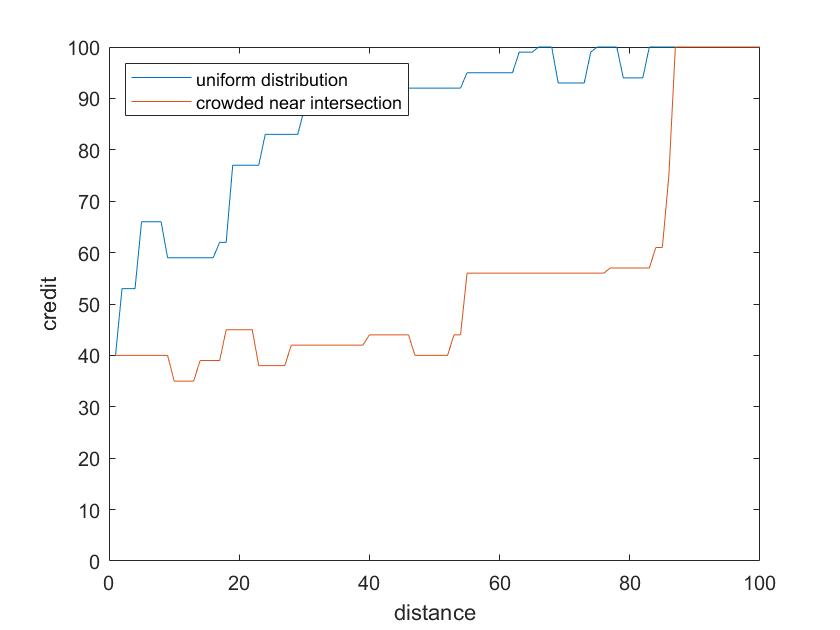
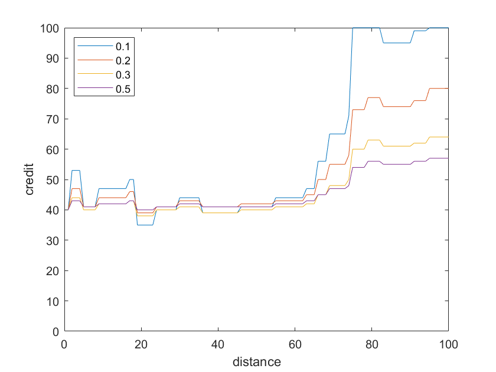
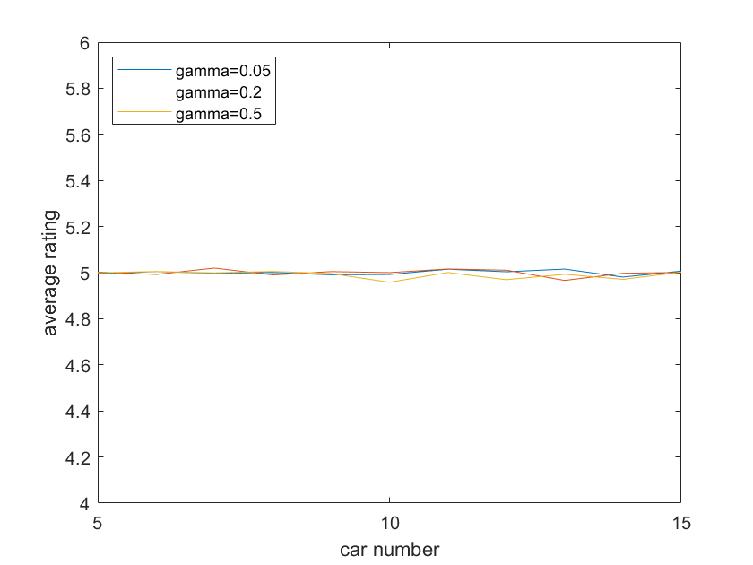
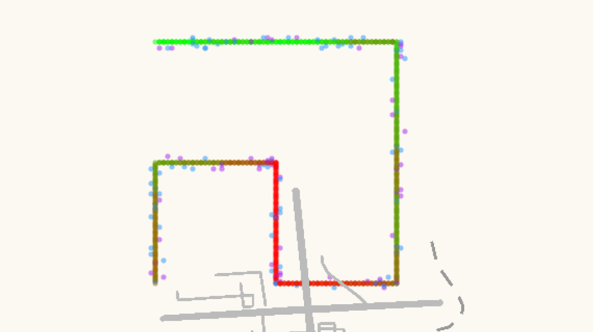
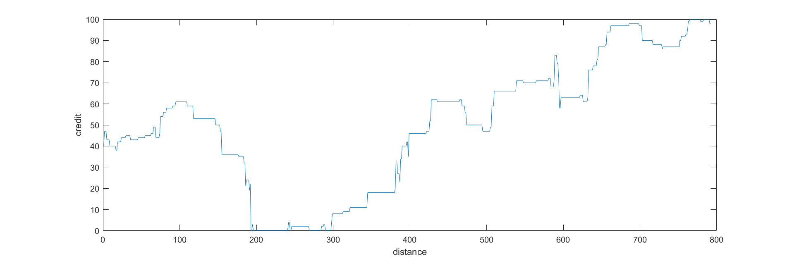

# 信誉值测试曲线

[toc]

## 测试方法

- 在模拟的田字格道路上进行测试，关注一个车辆的信誉值变化
- 田字格边长为100（个数据点）
- 与目标车辆进行交互的其他车辆随机静止分布在道路上，两车处于同一位置时模拟交互
- 进入新的田字格边时，位置验证的成功、失败次数清零
- 在遇到较密集车辆群时模拟消息发送，车辆距离由数据点间隔表示
- 消息可以发送给与目标车辆距离在五个数据点之内的其他车辆

## 位置验证

### 时间衰减系数

#### 不同取值下的随机测试

80%验证成功率，一条边（100个数据点）上20辆交互车辆，均匀/路口密集分布

- $\delta=0.1$

  数据波动幅度过大，车辆分布过于密集时很容易达到极端值；如果在密集车辆群中位置验证的结果不够确定，可能会出现在上下极端值间大幅波动的情况，使得信誉评估的结果不够准确。

  

- $\delta=0.2$

  

- $\delta=0.3$

  

- $\delta=0.5$

  波动幅度过小。由于区块链计算只保存结果的整数部分，衰减系数过大时会导致最终信誉偏移值的计算结果被削减至0，当位置验证不够频繁时，即使有效的位置验证结果也很难带来明显的信誉调整。

  

#### 相同验证情况下参数比较

- 80%成功率，车辆均匀分布

  

- 80%成功率，车辆在路口密集

  

- 60%成功率，车辆均匀分布

  

- 60%成功率，车辆在路口密集

  

补充记录 分析 为什么最后取这个值

### 加权平均

#### 公式修改

原计算公式：
$$
\Delta T_{\rm V}=\theta_{v1}*(success-s_v)+\theta_{v2}*failure
$$
修改为：
$$
\Delta T_{\rm V}=\left\{
\begin{array}{l}
max(\theta_{s}*(sRate+1)+\theta_{f}*fRate,0) & & 本次验证成功\\
\theta_{s}*sRate+\theta_{f}*(fRate+1) & & 本次验证失败\\
\end{array} \right.
$$
其中$sRate$、$fRate$分别表示车辆行驶历史中位置验证的成功率和失败率。

原公式中使用成功、失败的次数直接进行信誉偏移值的计算，导致在测试中成功、失败结果出现的顺序对于最后的信誉值曲线影响非常大，同时较为拥堵的区域里车辆会累积大量的历史验证结果，导致一次计算的偏移值非常大。除此之外，将$s_v$设置为常数，会在导致车辆较少的区域中，即使收到了成功的位置验证，信誉计算结果依然会对用户非常不利。

修改后的公式使用验证成功、失败的比率代替累积次数，来消除历史结果数量对偏移值大小的影响，同时强调当前验证结果的权重、减小历史数据的权重，以减弱验证结果顺序对曲线走势的影响。

**答辩时：公式变化过程**

#### 双参数大小关系

研究验证成功、失败对应的$\theta$参数之间的大小关系对信誉曲线的影响，取以下三组：
$$
\left\{
\begin{array}{l}
\theta_{s}=3 \\
\theta_{f}=-2
\end{array} \right.
,\ 
\left\{
\begin{array}{l}
\theta_{s}=2 \\
\theta_{f}=-2
\end{array} \right.
,\ 
\left\{
\begin{array}{l}
\theta_{s}=2 \\
\theta_{f}=-3
\end{array} \right.
$$
各组中的两个参数绝对值分别为大于、等于、小于的关系。一条边（100个数据点）上20辆交互车辆，车辆在路口处密集分布，位置验证成功率分别取80%、60%、40%，观察在验证结果相同的情况下不同参数对应的曲线。

三组参数对于位置验证失败情况的敏感度依次增强，尤其是对于连续、多次失败的场景。60%成功率对应的曲线中有比较明确的体现：第一组参数对应的曲线最终达到了信誉最大值，但是同样的验证结果下，第三组参数则使信誉在大部分情况下维持在较低（不可信）水平。

最终选择两参数的大小关系为$\theta_s<\theta_f$，是考虑到判定一个车辆可信应当需要其在一定程度上持续、稳定地与其他车辆完成成功的位置验证，相对地，验证失败对应的惩罚应当更大，否则仅靠较少的成功情况就能很快弥补信誉值的缺失是不合理的。

#### 参数具体取值

确定大小关系后，选取了几组参数进行进一步测试：
$$
\left\{
\begin{array}{l}
\theta_{s}=1 \\
\theta_{f}=-2
\end{array} \right.
,\ 
\left\{
\begin{array}{l}
\theta_{s}=2 \\
\theta_{f}=-3
\end{array} \right.
,\ 
\left\{
\begin{array}{l}
\theta_{s}=2 \\
\theta_{f}=-4
\end{array} \right.
,\ 
\left\{
\begin{array}{l}
\theta_{s}=3 \\
\theta_{f}=-5
\end{array} \right.
$$
一条边（100个数据点）上20辆交互车辆，车辆在路口处密集分布，位置验证成功率分别取80%、60%、40%，观察在验证结果相同的情况下不同参数对应的曲线。

选取参数时考虑以下几点：

- 信誉在更新频率较小的情况下仍能有明确的增减，计算结果被约至0的情况不能出现得过于频繁；
- 车辆密集、更新频繁的时候会导致数据较大的波动，在这种场景下尽量减少个别验证结果迅速颠覆整体可信度的情况；
- 在历史数据成功率较高的情况下，当次验证失败仍能保证信誉值有所下调，反之亦然，在参考历史数据的条件下尽量保证本次结果对信誉偏移的影响能得到充分体现。**保持原则**

### 参数确定后结果

$$
\delta=0.2 \\
\theta_{s}=2,\theta_{f}=-3
$$

- 不同验证成功率，直行道路上车辆均匀，路口处车辆密集

  

- 数据波动

  

## 消息传播

### 测试方法

5个数据点之内，5-15辆车

模拟目标车辆对周围密集的车辆群体进行消息发送得到的情况。车辆群体与目标车辆距离在5个数据点之内，数量在5-15之间变化。模拟时首先确定群体内车辆数，然后在距离范围内随机生成各车辆的位置，以及每辆车对目标车辆发送消息给出的评价。评价为1-10之间的整数。根据公式计算加权之后的总评价（取整）。对于确定的计算参数和车辆群体大小，重复上述过程1000次，计算总评价的平均值、极大极小值并绘制曲线。

### 距离衰减系数

距离衰减系数$\gamma$分别取0.05、0.2、0.5（、1），周围车辆群体大小范围为5-15。

- 周围车辆群体给出的评价值在1-10之间完全随机

  

  加权后的总评价平均值整体上稳定在5分，$\gamma$的取值、车浪群体大小对其没有明显影响。

- 中心与外围车辆评价差别大：与目标车辆距离在2个数据点之内的车辆被判定为中心车辆，其余为外围车辆。当中心车辆给出的评价在整体上与外围车辆相差较大时，观察加权后的总评价曲线。

  - 中心车辆评价普遍高于外围车辆（中心车辆打分集中在5-10，外围车辆打分集中在1-6）

    不可解释的数据波动（每条曲线的起伏程度）

    

    （带有极大极小值的图像）

    

  - 中心车辆评价普遍低于外围车辆（中心车辆打分集中在1-6，外围车辆打分集中在5-10）

    

    （带有极大极小值的图像）

    

  从以上两组模拟测试结果，可以看到车辆群体大小与总评价之间没有明显关系；$\gamma$取值越小，总评价在整体上就越偏向于中心车辆给出的评价。不完全随机的评价导致的数据波动幅度显然比完全随机要更大，$\gamma$取值较大时，周边车辆群体大小导致的数据波动下降，但是对于相同数量的群体来说，极端情况下给出的评价与平均值之间的差距要稍大一些。

  考虑到车辆距离与评价准确性之间的关系（中心车辆的评价通常来说比外围车辆更有说服力），以及数据的波动、稳定性等因素，选择较小的距离衰减系数$\gamma=0.2$。

### 可信程度划分

4-6

6+

4-

继续讨论 补充

## 地图展示

### 位置验证模拟

在参数确定之后，对位置验证的结果模拟流程如下：

- 每一区域（道路）对应一个位置验证成功率的范围，对于用户较熟悉的区域成功率较大（如70%-90%）；
- 在该区域（道路）行驶时，邻居车辆与目标车辆的位置验证成功率与它们之间的最短距离负相关，且保持在上述范围之内；
- 确定两车对应的成功率（如85%）之后，再通过伪随机数确定本次模拟位置验证的结果为成功或是失败。

### 可视化效果

蓝色、紫色点代表附近的邻居车辆，蓝色表示位置验证成功，紫色表示位置验证失败。

对应的信誉曲线：

- 车辆密度、用户活跃度（提交时间间隔）在曲线中能得到较明显的体现
- 信誉每次的增长或下降首先与本次位置验证/消息传播的成功与否有最大的关联，同时在一定程度上体现历史数据的整体趋势
- 在一段道路上，信誉在小幅波动的同时，整体趋势基本符合道路上的总体情况
- 在车辆过于密集的路口处有时会出现比较剧烈的数据波动，尤其是对于位置验证多次失败、信誉下降的情况

数据波动过于剧烈 时间衰减系数 加一个常数

一个点在运动

信誉值相互影响

