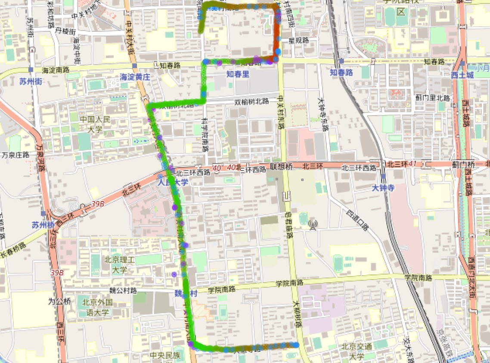
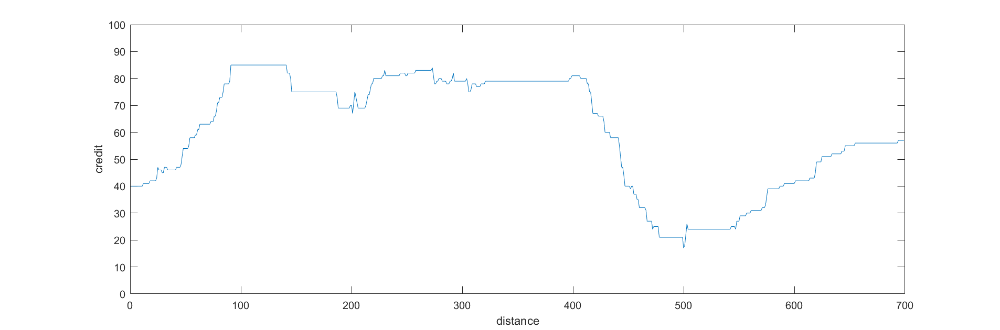

# 车载网信誉评估算法的设计与实现

[toc]

## 修改内容

- 1.3，以及2-5章的开头结尾内容
- 结构调整：
  - 将参数调优与综合测试拆成两章。感觉3.2的内容还是要放在参数测试前面比较通顺，所以原型系统章节还是放在了前面。
  - 原来的3.4（可视化展示）内容移到了5.1中，作为结果图的详细解释
- 2.1、3.1插图，补充了相应的解释

## 中文摘要

车载自组网是一种自组织、无中心的无线开放式网络，为交通参与者之间的通信而构建，基于网络可以实现安全监控、辅助驾驶、路况查询、事故预警等应用功能，提高人们的出行体验。车载自组网中包含大量车辆间交互的信息，但是由于其流动性强、时空特性变化快的特性，车辆间共享的信息并不总是真实可靠的，因此如何判断通讯对象是否可信成为保障自组网通信质量的关键。针对这一问题，本文提出了一个车辆信誉评估算法，基于车辆间交互的结果对交互参与者进行可信度的量化评估，主要考察位置验证、消息传播两类交互模式，同时引入时间与距离衰减、历史交互结果平滑等概念，使得算法在实际应用场景分析中展现出科学性与稳定性。

其次，本文实现了一套车辆信誉评估的原型系统，在系统中通过区块链智能合约实现了上述算法，保证信誉评估过程的安全性；同时将智能合约与浏览器进行结合，在浏览器端实现了车辆行驶信息的获取、车辆交互结果的模拟以及信誉评估结果的地图展示。利用该原型系统，本文设计了多种交通场景的模拟实验，对信誉评估算法的参数特征进行了分析与调优。最后，本文使用模拟数据与真实数据对系统进行了完整测试，分析了信誉评估结果与算法设计目标的符合情况，从而验证了信誉系统的可行性。

关键词：车载自组网；信誉评估；区块链；位置验证；消息传播

## Abstract

VANET is a self-organizing, decentralized and open wireless network, constructed for communications between traffic participants. Based on VANET, various applications can be developed for safety monitoring, auxiliary driving, traffic inquiry, accident alerting, etc., which help provide people with better transport experience. VANET contains myriad information about interactions between vehicles, but due to the high mobility and time-space variability of the network, shared information cannot always be trusted. Therefore, it becomes a key problem to determine whether the target for communication is reliable. As a solution, this article proposes an algorithm for vehicular trust evaluation, which gives a quantitative assessment for the credibility of a vehicle based on the results of its interaction with other vehicles. The algorithm mainly involves two interaction patterns, proof of location and message transmission, and further introduces damping factors based on time and distance, as well as interaction history for result smoothing, showing plausibility in the analysis of practical scenarios.

Secondly, the article develops prototype system for vehicular trust evaluation, using smart contract on blockchains to realize the algorithm while ensuring safety for the calculation process; the smart contract is then combined with a browser-side program, where vehicle locations are acquired, interactions simulated and evaluation results displayed. Using this protosystem, this article designs a series of simulation experiments for various traffic conditions, in order to analyse, adjust and optimize the parameters of the evaluation algorithm. Finally, the article runs integrated tests on the protosystem using both simulated and real GPS data, compares the result with the design goals of the algorithm, and confirms the feasibility of the system.

Keyword: VANET; trust evaluation; blockchain; proof of location; message transmission

## 1 绪论

### 1.1 研究背景

交通是人类社会进步过程中不可缺少的一环。随着交通系统基础设施的逐步完善，人们在依赖便捷交通的同时也产生了更多的需求；面对出行安全、道路规划、环境污染等诸多潜在问题，智能交通系统的概念诞生了，旨在将基础设施与先进的信息技术结合，利用交通环境中产生的大量信息进行数字化、智能化的管理。

车载自组网（VANET，vehicle ad-hoc networks）正是智能交通系统框架中的重要概念之一。车载自组网是专门为车辆间通信而设计的自组织网络，其基本思想是在一定通信范围内的车辆可以共享自己的地理位置、行驶状态以及车载传感器感知的数据，并自发地连接建立起一个移动的网络。通过这些数据的传递，可以实现路况查询、事故预警等功能，从而提高人们的出行体验和整体的交通效率。

然而，考虑到车载自组网通信对象陌生、时空特性变化快的特点，相互通信的邻近车辆不一定是完全可信的，特别是当道路上存在意图在车载网中进行恶意攻击的车辆时，很可能会导致更加严重的安全问题。因此，如何对接入网络的车辆进行科学的可信度评估，成为了保障车载网安全性的一个重要问题。对所有车辆进行公开的信誉评估，可以使车辆在网络通信的过程中自行决定是否信任对方提供的信息，从而在系统层面上确保交通状况能得到真实、准确的反映，并且行驶车辆能够及时地接收到这些信息。

区块链技术起源于比特币，本质上是一种分布式的共享账本和数据库，具有去中心化、不可篡改、可追溯、集体维护、公开透明、时序性强等特点。对于没有网络中心、流动性强的车载网来说，区块链技术的应用可以很好地提供一个车辆间协作的便捷途径，为位置验证、消息传递等功能提供安全性的保障。

基于车载网上车辆的交互信息，设计一套评估车辆信誉的算法，并基于区块链技术实现一套车载网络中的车辆信誉评估系统，与车辆的位置验证、消息传播等应用活动进行结合。

### 1.2 相关工作

#### 1.2.1 区块链技术/去中心化的车载网

区块链技术起源于比特币，是近年来逐渐兴起的一种互联网应用模式，其中涉及到点对点传输、分布式管理、去中心化、共识机制、加密算法等技术，在金融领域大获成功之后，逐渐扩展至公共管理、物联网、医疗等领域。在汽车领域，文献[12]利用区块链为智能车辆实现了一种安全的交易体系结构，将数据与区块链交易分离，可以在车辆保险费用缴纳等方面进行应用。

智能合约是区块链的核心技术之一，为区块链去中心化的特点提供了技术上的重要支持。智能合约从被触发到运行完成的流程可合并为一次原子操作，它按照获得全网共识的计算规则自动执行合约内容，在不需要第三方介入的情况下完成安全可靠的合约执行，具有安全可靠、不易篡改的特点。目前，以太坊智能合约的应用较为广泛。文献[11]将以太坊账户作为车载网参与者的个人账户，通过定制智能合约实现可查询交通违法记录、缴纳各项费用的自管理系统。

#### 1.2.2 车辆位置验证

位置验证是证明一个人在某个时间处于某个确定的地理位置的一个数字签名[1]。车载自组网中要求车辆提供具有时效性、准确性的位置验证，以便于更多的车辆行驶信息能有效地应用于更多基于位置的服务（ Location-Based Service，LBS）。

目前，多数车辆位置验证采用的是依赖于网络基础架构的集中式验证，主要通过无线接入点和蜂巢网络为用户提供位置验证。[2-3]这种验证方式在服务器上统一存储用户提交的位置验证申请，以及对其进行确认所需的信息。然而考虑到车载网的流动性，集中式验证往往难以满足车辆对于实时性的要求；同时，作为绝对权威的中心服务器一旦遭受攻击，所有接入网络的车辆都将面临严重的安全问题。

不依赖网络基础架构的验证方式通常利用邻近车辆或车上的移动设备获取有效的位置验证。该验证方式要求参与设备具有一定的短距离通信功能（比如蓝牙）[4]，通过带有私钥签名的点对点传输完成验证，并在互联网中传播验证结果；特别地，对于分布式的位置验证系统，传播后的位置验证结果被写入区块链中[1]。

#### 1.2.3 车载网信誉管理系统

中心化的车辆信誉管理系统通常使用一个服务器作为完全可信的权威机构，车辆之间的反馈被统一提交并在服务器上进行信誉的计算[5]；这种利用单一中心节点的方式随着智能交通系统的快速发展，已经很难承担起大量车辆对低延迟数据获取的需求。对于去中心化的信誉管理系统，信誉计算的压力被分配到了车载网中的各个节点上，通常在各车辆[6]或是路侧单元（Roadside Unit，RSU）[7]内部执行；但是在本地计算的信誉值很难保证可靠性，同时由于RSU作为分布在室外的基础设施，比较容易受到攻击和损害。[8]提出了一种基于区块链技术的去中心化车辆信誉管理方式，利用RSU进行数据处理和信誉维护，并通过区块链结构保证数据的同步和安全性，降低单个RSU故障对系统带来的影响；同时，该文章提出了一种基于消息评价的信誉计算方法。文献[9]中的车辆信誉受车辆间数据信息交易结果的影响，对于每一台车辆维护一个朴素贝叶斯网络，在其叶节点中更新该车辆各个交易身份对应的不同信誉值。

### 1.3 论文的研究内容及贡献（及组织结构）

本文设计了一套车载自组网中车辆信誉评估的算法，并基于该算法实现了一套信誉评估系统。

1. 基于车辆的行驶状态和车辆在网络中的交互，提出一套信誉评估算法，使得车辆的可信度能够得到较为全面、真实的反映，同时利用以太坊智能合约实现该算法。
2. 设计实验，通过模拟数据对算法中的参数特征进行测试、分析与调优，评估参数选取对算法科学性、稳定性的影响。
3. 将智能合约与网页端结合，实现车载网信誉评估的原型系统，使得车辆行驶数据与信誉值在区块链上得到分布式存储，同时在浏览器端进行车辆交互的模拟、信誉评估结果的展示；同时利用该原型系统对模拟数据及真实数据进行测试，验证测试结果与算法设计目标的对应情况。

## 2 车辆信誉评估算法的设计

在已有工作中，多数车辆信誉评估的相关算法都基于车辆单独的驾驶行为，或者只针对在行驶过程中车辆某种特定的行为，车载网中大量的信息交换没有得到充分利用。本章提出了一套基于车辆交互结果的信誉评估算法，主要由交互活跃度、位置验证结果、消息传播结果三部分构成，同时通过对具体场景的讨论分析算法的科学性与可靠性。

### 2.1 基本思路

#### 2.1.1 信誉值影响因素

车辆在行驶过程中携带了大量信息，如何筛选这些信息、保留对于车辆信誉最具有代表性的关键因素是设计该算法的第一个问题。考虑到车辆信誉值本质上是其他车辆用于决定是否信任该车辆的判断指标，车辆在自组网中参与的信息交互结果应当是信誉评估的主要影响因子。而一辆车自身的行驶状态，譬如行驶速度、运动轨迹、驾驶员操作等信息，尽管可以对信誉判断起到辅助作用，但是不属于展现该车对邻近车辆是否可信的主要参考指标，通常也无法直接地反映其信誉；因此，为了保证算法的简洁性，这类因素不属于笔者进行算法设计时的考量目标。

本文提出的车辆信誉算法主要受到以下几个因素的影响：

1. 用户活跃度。车辆上传有效数据、更新状态的频率越高，其对应的信誉增益就更加明显，这代表它在车载网中积极地进行信息交互，并且共享的信息频繁地得到了其他车辆的确认。如果车辆很少在网络中与其他车辆进行任何互动，那么极其稀疏的数据提交对其信誉增长的帮助将是非常有限的：一方面是由于车辆的信誉同样具有时效性，在计算时需要保证信誉值能准确地体现车辆当前的可信程度，用户长时间的沉寂会使其历史信誉不再具有足够的效力；另一方面可以防止恶意车辆用户和少量的同谋伪造有效信息，仅通过少量的数据提交就能获得很好的信誉评价。
2. 车辆交互的结果。这是本文算法进行信誉评估的主要计算依据，因为车辆之间进行信息交互的结果、邻近车辆对于信息的评价是直接体现车辆可信度的指标。其中，车辆的交互方式主要包括：
   1. 位置验证。车载网在应用中包含众多基于位置的服务，因此位置验证是车辆行驶过程中进行得较为频繁的一项例行交互行为。车辆通过短距离通信向邻近车辆发送请求，表示自己希望得到位置验证，然后邻近车辆根据自身的定位信息和请求者提供的地理位置，返回经过自己确认的验证结果，可以视为一次成功的位置验证。成功的位置验证可以确认车辆提供的地理位置信息的准确性，以及在对应的信息交换过程中的诚实行为，从而得到信誉值的提升；相反，位置验证失败可能意味着车辆自身定位不够准确、车辆故意捏造虚假的位置信息等状况，但无论如何，验证失败都代表车辆提供的信息对于网络中的其他用户来说是不够可信的，因此其信誉值会相应减少。
   2. 消息传播。车辆之间传播的消息，譬如路况提示、事故告警等，其发生频率低于位置验证，但同样是衡量车辆可信度的重要指标。车辆的信誉由其发送消息的质量（准确性、及时性）体现，每条消息的质量通过其他收到消息的车辆对其给出的评价来确定，而周围车辆给出的评价是否客观准确，则和它与消息发送者之间的距离相关。
3. 监督与举报。上述车辆交互通常限于两辆车之间，但是为了防止恶意信息的伪造和传播，车辆信誉评估的系统同样鼓励第三方对交互内容的监督和举报。不论是位置验证还是消息传播，相关数据都将在车载网内部进行传播，收到信息的第三方车辆可以对其内容进行检查，并举报虚假信息的存在。由于这一行为需要用户额外的计算开销，因此举报成功可以获得相应的信誉值奖励，同时被举报的恶意用户将受到严厉的惩罚。

#### 2.1.2 算法流程

算法基于车辆交互的结果，针对单个车辆的信誉进行计算；使用路侧单元（RSU）作为主要的计算实体，同时目标车辆周边的邻近车辆在消息评价等环节进行辅助的评估。在实际应用中，RSU使用区块链结构进行信誉维护，使得信誉评估的过程得到安全性的保障。在目标车辆完成一次与邻近车辆的交互后（如进行一次位置验证，或发送一条消息），交互结果被上传到RSU，并根据本章提出的算法进行信誉偏移值的计算，并更新目标车辆的信誉值。

图2.1是信誉评估算法的整体流程示意图。目标车辆可向邻近车辆发送位置验证请求，或进行消息的传播，对于两种交互方式，邻近车辆分别给出位置验证的结果或者对于消息的评价。算法中包含基于两种交互模式的信誉计算方案，对交互结果在RSU中分别进行相应的处理，最后将计算得到新的信誉值传输给目标车辆。

### 2.2 信誉计算方式

本节将介绍车辆信誉算法涉及到的具体公式。将目标车辆的信誉值记为$T$，$T$是在$[0,100]$范围内的整数。在目标车辆作为新用户加入到车载网中时，它被赋予初始信誉值$T_0$。每次进行位置验证或消息传播后，车辆间交互的结果将被用于计算目标车辆新的信誉值$T'$。下面介绍信誉值更新的具体算法。

#### 2.2.1 时间衰减系数

目标车辆基于一次交互更新的信誉值为：
$$
T'=T+\Delta T*D(t)公式(2-1)
$$
其中$T$为本次信誉计算前车辆的原始信誉值，$\Delta T$为根据本次交互结果计算得到的信誉偏移值，$D(t)$表示基于数据提交时间间隔得到的时间衰减系数，其计算方法如下：
$$
D(t)=\frac{1}{\delta*(t-t_l)}公式(2-2)
$$

其中$\delta$为参数，t表示本次提交数据的时间，t_l表示上一次提交数据的时间。通过公式（2-2）引入时间衰减系数，目的在于以数据提交时间间隔对用户活跃度进行量化。在公式（2-1）中将信誉偏移值与时间衰减系数进行叠加，使得活跃度这一指标在信誉调整的幅度上能够得到明确的体现，而同时避免了交互结果对信誉的影响被完全覆盖：成功的交互必然能导致信誉提升，失败的交互必然能导致信誉下降，但是交互的频率作用于信誉的增减幅度，长时间不提交数据会导致一次交互结果对信誉值的总影响减弱。

#### 2.2.2 基于位置验证的信誉计算

在目标车辆进行一次位置验证之后，其信誉偏移值的计算方式如下：
$$
\Delta T=\left\{\begin{array}{l}
max(\theta_{s}*(sRate+1)+\theta_{f}*fRate,0) & & 本次验证成功\\
min(\theta_{s}*sRate+\theta_{f}*(fRate+1),0) & & 本次验证失败\\
\end{array} \right. \\
公式(2-3)
$$
其中sRate、fRate分别表示目标车辆在近期一段行驶历史中位置验证的成功率和失败率。该公式保证了本次验证结果对信誉偏移方向的决定性影响：本次验证成功必然使信誉提升，本次验证失败必然使信誉下降。除了对当次位置验证结果进行考量之外，公式（2-3）还引入了历史记录中的验证结果，在保证本次验证占有最大权重的同时对信誉偏移的计算结果进行平滑处理。

#### 2.2.3 基于消息传播的信誉计算

在目标车辆i向周围车辆发送一条消息m之后，收到这条消息的邻近车辆j将根据消息内容的准确性对其进行打分，分数$R_j^m$为[1,10]之间的整数。在汇总了所有周围车辆对消息m的打分之后，可计算其总评价：
$$
Cred_m=\frac{\sum_jw_{ij}*R_j^m}{\sum_jw_{ij}}公式（2-4）
$$
其中权重$w_{ij}$由车辆$i$、$j$的距离$dis(i,j)$决定：
$$
w_{ij}=e^{-\gamma* dis(i,j)}公式（2-5）
$$

在公式（2-4）中，对邻近车辆的打分进行加权的意义在于，邻近车辆对消息内容的评价应当基于自己对实际情况的观察，因此其评价与自身和消息相关事件之间的距离也有一定关系。考虑到这条消息描述的是目标车辆所处位置的事件，故可用目标车辆和邻近车辆之间的距离表示消息描述事件和消息评价者之间的距离。从公式（2-5）中可以看出，两辆车距离越近，对应的消息打分所占权重越高，代表该邻近车辆对事件的观察、对消息的评价更具有说服力。

在计算得到消息m的总评价后，可根据Cred_m判定消息是否可信，从而计算相应的信誉偏移值：
$$
\Delta T=\left\{\begin{array}{l}
Reward=\alpha*D*\frac{1}{e^L}       &      & {Cred_m\geq C_0,消息可信}\\
Punishment=(-1)*\beta*D*\frac{1}{e^L}     &      & {Cred_m<C_0,消息不可信}\\
\end{array} \right.\\
公式(2-6)
$$
其中$C_0$为参数，D表示车辆密度，L表示消息的紧急级别（$L=1$：事故警告；$L=2$：路况提示）。可以看到，车辆密度越大、消息内容越紧急，计算得到的信誉偏移幅度就越大，因为有更多的车辆受到了这条消息的影响。

### 2.4 科学性分析

当车辆在道路上正常行驶，并能够持续、稳定地与周围车辆完成交互时，该算法显然能保证目标车辆信誉值的稳步上升；然而实际应用中，可能会遇到各种特殊情况，不论是否是人为制造，都会导致车辆交互失败并使其信誉值下降。本节将针对一些可能出现的意外情况进行具体讨论，分析上文提出的算法是否能在这些情况下合理、公正地体现车辆信誉的变化。

1. 客观原因导致交互失败。目标车辆可能由于自身设备出现故障等原因，导致无法获取准确的地理位置信息，或者中断与其他车辆的通讯，进而导致信誉值的下降。这种情况的出现，并不违背本文算法设计的前提：车辆信誉值是为其他车辆提供的、用于判断该车辆提供信息是否可信的评价指标，即使是由于客观原因导致的交互失败，也意味着目标车辆当前的状况并不适合与其他车辆共享信息。对于个别偶然的失败情况来说，本文算法引入了历史记录进行偏移值的平滑，这使得拥有良好交互记录的车辆不会大幅损失信誉值；如果在一段时间内存在持续的失败交互，车辆的信誉值将降低至不可信水平，但是如果影响车辆的客观因素消失，其信誉值还能够通过之后的正常活动重新回升。
2. 恶意诋毁。道路上可能存在一些恶意的车辆，在作为邻近车辆参与交互时故意给予负面的反馈，譬如声称其他车辆位置验证请求中的地理信息不合法，或者故意给其他车辆发出的消息打出低分。本文算法没有为了避免这种情况而进行专门的设计，但是可以看到当这种恶意车辆在整体交通中仅占少数部分时，它们的诋毁行为不会对诚实车辆的信誉产生明显的影响。对于位置验证，考虑到历史验证成功率对整体结果的平滑，个别的验证失败结果对车辆可信度影响不大。对于消息传播，消息总评价由多车打分的加权平均得到，并且最终只通过消息是否可信来判定信誉值增减，而不考虑可信范围内具体的分数高低。因此，少数的恶意负面评价通常也很难影响最后的整体结果。
3. 多人合谋：车载网系统中还可能面临的一种安全威胁，是多台恶意车辆之间的合谋，例如一台恶意车辆可以发送包含虚假位置信息的位置验证请求，而其合谋者为其提供捏造的确认信息，两者通过这种形式完成了一次成功的位置验证并获得了信誉值的提升，尽管验证的信息实际上并不合法。对于本文提出的算法来说，这种形式的攻击仅当与之合谋的车辆足够多时才能够收获明显的效果。这是因为区块链上维护了一段时间内的车辆交互结果记录，而同一对车辆在这段时间内不能反复地进行同样的交互。如果其他车辆能够正常地识别恶意车辆信息的异常，那么这种合谋行为也难以有效地提升其信誉值，除非周围的车辆都是与之串通的共犯；但是在实际情况中，这样做的伪造成本会变得极其高昂，再考虑到车辆的流动，其可行性也是较低的。

### 2.5 本章小结

本章介绍了对车辆信誉进行计算时所考量的因素以及具体的计算公式，并通过一些可能出现的实际情况分析了算法的合理性与科学性。算法主要依靠车辆之间交互的结果确定信誉的增减，包括位置验证和消息传播两部分；其中，对位置验证结果的计算中引入了历史验证成功率进行结果的平滑，对消息评价的计算中考虑了交互车辆之间的距离对评价权重的影响。同时，算法引入了引入了时间衰减系数，根据活跃度调整信誉增减的幅度。最后，本章分析了该算法的科学性与稳定性，对于可能的意外故障或潜在的恶意攻击，该算法都能较好地通过信誉值反映车辆当前的实际状况。

## 3 信誉评估算法原型系统的实现

本章对车辆信誉评估算法的原型系统进行了详细的介绍。该系统主要由浏览器端和智能合约端两部分构成。浏览器端主要进行车辆行驶数据获取、车辆交互模拟以及行驶状态的可视化展示，智能合约端负责数据的存储以及车辆信誉评估算法的具体实现。原型系统的整体架构如图3.1所示。

### 3.1 总体框架及运行环境

信誉评估算法的原型系统框架主要分为两个部分：浏览器端及智能合约端。浏览器端模拟实际场景中的车辆终端，进行位置信息获取、车辆交互等数据处理任务；智能合约端模拟实际场景中的路侧单元（RSU），对车辆的信誉进行更新和维护。考虑到智能合约对于复杂运算存在较大的限制，同时区块链上的大量计算需要付出相应的执行费用，因此该原型系统中位置验证、消息传播的模拟由浏览器端负责，将模拟的交互结果上传至区块链后，合约端仅负责信誉值的评估计算。本原型系统的运行流程如下：

1. 系统初始化。浏览器端通过web3.js接口对信誉评估的智能合约进行初始化，同时加载地图和车辆行驶的道路数据，转化为Geohash格式存储，便于之后的合约计算。结合加载的缓存数据，为目标车辆生成用户的通用唯一识别码，作为该车辆身份的确认证明，此后浏览器端将对该目标车辆的行驶路线和信誉值变化进行追踪。
2. 模拟车辆交互。车辆交互结果的模拟是浏览器端的重要部分，该步骤中程序对目标车辆和其行驶途中遇到的邻近车辆分别进行位置验证和消息传播的模拟，并最终给出模拟交互的结果。具体实现方式见3.2节。
3. 上传交互结果。获得交互结果（位置验证结果或者邻近车辆给出的消息评价）之后，浏览器端利用web3.js接口将该结果的相关数据打包上传至区块链，在合约端进行结果数据的存储，并进行信誉值计算。
4. 信誉评估。信誉评估是合约端程序的主要内容，依据模拟交互的结果、数据上传的时间及上一章中设计的算法进行信誉值的计算和更新。针对智能合约在计算开销方面的限制，笔者在信誉评估合约中采取了一系列简化计算的措施，具体情况见3.3节。
5. 地图展示。浏览器端使用了leaflet（一个开源的JavaScript互动地图库，适用于移动设备）进行地图及车辆行驶路线的展示。在合约端完成信誉值的更新之后，浏览器端可以通过web3.js接口获取更新之后的信誉值，该信誉值及本次车辆交互的结果都可以在leaflet地图中得到清晰的展示，具体的展示效果在第5章中进行了详细描述。

本章中的系统在Ubuntu 20.04操作系统中实现，使用Solidity v0.8.0实现智能合约，并通过Web3.js v1.2.9实现浏览器端功能，以及与以太坊区块链的对接。在系统开发及测试过程中，使用Truffle v5.1.62进行智能合约的编译与本地私有链的部署，同时结合私有链的可视化工具Ganache v6.12.2进行便利的调试与开发。

### 3.2 车辆交互模拟

该原型系统中，浏览器端负责车辆交互的模拟，其中包括位置验证的模拟和消息传播的模拟。对于位置验证，每次模拟只涉及到目标车辆和一台邻近车辆；对于消息传播，每次交互（即同一条消息的发送与评价）涉及到目标车辆及其周围的多方车辆。在程序中两种场景的模拟独立进行，分别选取对应的参与车辆并各自进行交互的模拟，两者的结果互不影响。下面，文章将分别介绍两种交互的具体模拟形式。

#### 3.2.1 位置验证模拟

在目标车辆行驶过程中，它可以向一定范围内的邻近车辆发送希望获得位置验证的请求，当一辆邻近车辆收到该请求后，可以视为两辆车进行了一次位置验证的交互，而最终是否获取有效的位置验证即为本次交互结果成功或失败的判断标准。在实际情况中，位置验证是否成功可能取决于以下因素：参与交互的车辆对当前行驶区域的熟悉程度；交互车辆获取地理位置信息的准确度；交互车辆之间的通讯信号强度；交互车辆中是否存在恶意行为。

在本文所实现的原型系统中，对位置验证过程中通信的具体内容不做过多考虑，仅通过上述影响因素模拟位置验证的结果，具体思路如下：

1. 对于目标车辆当前所处区域（在该原型系统中，区域按照具体的城市道路进行划分），根据目标车辆行驶的历史数据，每个区域拥有一个对应的位置验证成功率范围。目标车辆经常行驶的区域，对应的验证成功率范围相对更高；对于不够熟悉或者未曾到访过的区域，对应的验证成功率范围相对较低。
2. 目标车辆与邻近车辆进行一次位置验证交互时，其成功率在上述成功率范围之内波动，并最终由两辆车之间的交互距离所确定。其中，交互距离为两辆车在各自行驶途中所能达到的最短距离，该距离与位置验证的成功率成一次负相关关系。
3. 在确定了当次位置验证的成功率之后，程序通过伪随机数模拟得到最终的位置验证结果为成功还是失败，并将该结果及相关数据上传至合约端。
4. 特别地，在参数测试与评估阶段，为了对算法中各参数取值在不同环境下的表现进行统一的表现，部分参数测试中略去了行驶道路和交互距离对验证成功率的影响，仅通过伪随机数模拟来观察在确定的验证成功率条件下不同参数取值对系统的影响。

#### 3.2.2 消息传播模拟

在特定事件（比如道路拥堵、交通事故等）发生时，目标车辆可以向邻近车辆发送消息，告知自己观察到的事件信息。由于特殊事件的发生属于偶然情况，因此消息传播这一交互行为的频率相对较小，并且每次仅对一定范围内的特定车辆群体有效。邻近车辆对消息内容的评价和自身与实际事件发生位置之间的距离相关，在本系统中使用该车辆与目标车辆之间的距离进行替代。

与位置验证类似，在程序实现中笔者同样忽略具体的事件及消息内容，主要对接收消息的车辆群体及它们给出的消息反馈进行模拟，主要流程如下：

1. 确定接收消息的邻近车辆。以目标车辆为中心，取与之相距在五个单位之内的所有车辆，为接收到本次交互消息并给出评价的车辆群体。在模拟测试中，周边车辆沿道路呈区域性的均匀分布（车辆密度不同）；在实际测试中，周边车辆的分布则完全由真实数据决定。
2. 模拟邻近车辆的消息评价。每台收到消息的车辆给出对消息的打分，分数是[1,10]之间的整数。在参数测试阶段，为了对距离衰减系数$\gamma$的取值进行评估，并对消息总评价进行可信区域划分，该部分选取了几种消息评价的分布情况，分别进行模拟：评价分数在[1,10]之间完全随机；评价分数较为统一（一致在5分以上或一致在5分以下）；与目标车辆距离较近的中心车辆给出的分数和边缘车辆相差较大（中心车辆评价大于5分、边缘车辆评价小于5分，或者相反情况）。
3. 在浏览器端收集各邻近车辆给出的消息评分，并预先计算每辆车与目标车辆之间的距离，保证评分与交互距离一一对应，并将数据打包上传至合约端。

### 3.3 信誉评估智能合约

智能合约中实现了第2章中的信誉评估算法，并进行相关数据的存储，在实际应用中对应路侧单元（RSU）的功能。由于合约部署在区块链上，具有公开透明、可追溯等特点，因此为信誉计算提供了安全性的保障，从底层结构上确保这一过程是具有权威性的，避免了对信誉值可能的篡改行为。

在本文实现的合约中，以用户为单位进行数据的维护，通过通用唯一识别码（UUID）与用户信息的数据结构user建立映射。在用户信息中，主要维护的数据内容包括历史数据提交时间、位置验证的历史结果统计、用户信誉值等。除此之外，合约中还实现了message数据结构，用于消息传播发生时的信誉计算，其中维护消息发送者UUID、各车辆给出的消息评分、各车辆与消息发送者之间的距离等。

当且仅当目标车辆与邻近车辆完成一次交互模拟之后，浏览器端会上传相应的数据并调用合约中信誉计算的相关接口；合约端则根据交互类型，选择进行位置验证或消息传播结果的数据处理，并进一步完成信誉值的更新。

由于智能合约端的每次计算都会消耗一定的gas（执行开销），同时对内存访问和复杂的数学函数都具有一定的限制，因此合约实现的难点之一就在于在原有算法的基础上对合约计算进行尽可能的简化，采用的具体措施包括：

1. 使用Geohash存储地理位置信息。Geohash是一种地理编码系统，它将传统的经纬度位置信息转换为一维的字符串，每个字符串对应一块矩形的地理区域[10]。使用这种方式存储位置信息，可以在精度允许的范围内对车辆进行定位，同时将与距离相关的计算过程和结果全部转移到整数范畴中，相比于利用经纬度计算得到了大幅度的精简。
2. 在浏览器端进行数据预处理。为了节省合约端的计算开销，部分不与信誉值直接相关的数据可以在浏览器端提前进行计算，比如消息传播过程中各车与目标车辆之间的距离，而在合约端只保留信誉计算的核心步骤。
3. 简化参数相关的计算过程。对于合约端较为复杂的计算步骤，可以事先计算出中间结果，将中间结果作为实际计算的参数。譬如消息传播中涉及到的指数计算，由于系统实现中$dis(i,j)$的实际取值仅限于[0,5]之间的整数，因此在参数$\gamma$确定后可直接计算得到几种可能的幂值并将其作为参数写入程序中，在信誉计算的过程中根据距离直接获取相应的中间值即可。

### 3.4 本章小结

本章介绍了车辆信誉评估算法原型系统的具体实现。该系统在浏览器端进行车辆交互的结果模拟以及行驶状态的可视化展示，在合约端完成数据存储以及车辆信誉评估算法的实现，通过区块链保证了信誉计算的安全性与可靠性。同时，为了解决智能合约对于复杂数学计算的限制，系统在合约编写方面对具体计算方式进行了一系列优化措施。

## 4 信誉算法的参数调优与特征分析

本章使用上述原型系统，针对信誉算法各项参数取值对于系统敏感度、精确度的影响设计了实验。实验对车辆行驶场景进行简化与模拟，通过构造多种不同情况下的交通状态与车辆交互结果，完成对信誉评估算法中各项参数的特征分析和结果调优。

### 4.1 测试方法

在本节的模拟测试中，笔者将实际交通地形与车辆行驶状况进行了简化，构造沿经线或纬线分布、长度一致、呈田字格式排列的道路，使模拟的目标车辆在道路上匀速行驶，并以相同的时间间隔更新自己的位置信息。

在下文所述的模拟实验中，目标车辆每隔1秒种更新一次自己的位置，走完田字格道路的一条单位边共需100秒，即一条道路上均匀分布行驶轨迹的100个数据点。生成的原始数据点坐标由经纬度表示，经过转换计算可知，两个相邻数据点之间间隔约为10米；在以下实验中，为便于计算与表述，称该长度为单位距离，称田字格道路的一条单位边为一条道路。

因为该实验只对目标车辆的信誉变化进行追踪，因此在邻居车辆的模拟数据生成时，仅生成两辆车交互成功时邻居车辆的坐标点，而不对其进行动态的轨迹模拟。

### 4.2 参数设计与分析

本节将根据模拟测试的结果，对车辆信誉算法的各个参数取值进行调优，主要评价内容及分析指标如表4.1所示。

| 测试参数                                          | 评价指标                         |
| ------------------------------------------------- | -------------------------------- |
| 时间衰减系数的缩放参数$\delta$                    | 信誉变化敏感度                   |
| 位置验证权重参数$\theta_s$、$\theta_f$            | 信誉变化趋势、对错误结果的敏感度 |
| 消息传播的距离衰减系数$\gamma$、消息可信阈值$C_0$ | 评价结果波动性                   |

#### 4.2.1 时间衰减参数

本实验基于真实的交通状况，对道路上的车辆分布进行了两种模拟：在一条道路上车辆均匀分布，或者在道路的前半部分均匀、相对稀疏地分布，在靠近道路末尾处车辆密集分布。两种情况分别模拟了车辆正常行驶以及在路口处进行等待两种情况。具体地，两种模拟情况中一条道路上都有20台邻近车辆，其中正常行驶情况下20辆车在道路上呈随机、均匀分布，路口等待情况下10辆车在道路前80%部分随机分布、10辆车在后20%部分随机分布。

图4.1展示了时间衰减系数的缩放参数$\delta$在不同取值下，目标车辆在一条道路上完成随机生成的20次位置验证所对应的信誉曲线变化。其中，各组实验的位置验证总成功率均为80%，每张子图中的两条曲线分别对应车辆均匀分布、路口处密集分布两种情况。

图4.1：四张图拼起来

可以看到，在位置验证成功率较高的条件下，各组实验中目标车辆的信誉曲线基本都呈上升趋势，但是数值的波动对数据提交时间的敏感度相差很大；尤其是当有多辆车在路口处密集分布时，过小的缩放参数与频繁的数据提交非常容易导致信誉值的暴涨或暴跌，而这一现象可能只需要两到三次集中的位置验证结果就能发生。相反地，同样可以看到，当该缩放参数取值过大时，目标车辆在正常行驶的过程中则很难产生足够明显的信誉值变化，必须依靠足够密集的数据才能使其得到实质上的提升。该结果一部分是由于智能合约上对数据计算的限制，系统最终会将信誉偏移值归约为整数，如果对数据提交时间的缩放系数不够小，该计算结果很容易会被削减至0，使得交互结果对信誉的影响完全得不到体现。

图4.2更加明显地体现了参数$\delta$的取值对系统敏感度的影响。本组实验选取了不同的位置验证成功率和邻近车辆分布，对于每种情况都随机生成同一组交互结果，每个子图展示了在该组交互结果下参数不同取值对信誉曲线的影响。可以看到，每组实验中信誉曲线的整体走势基本一致，但是数据增减的幅度差别很大。考虑到需要让系统对交互结果拥有足够的敏感度，同时避免车辆密集的情况下出现极端的波动，经过多次对比试验，确定$\delta=0.2$为合适的缩放值。

图4.2：四张图拼起来

#### 4.2.2 基于位置验证的信誉计算参数

在对位置验证结果的信誉计算中，验证结果成功、失败分别对应一个权重参数$\theta_s$、$\theta_f$。本节的实验中，首先对两参数绝对值的大小关系进行讨论，然后再针对具体取值做进一步的实验。

对于车辆在路口处密集分布的情况，假设总体的位置验证成功率为80%、60%、40%，对这三种场景分别随机生成一组验证结果，具有不同大小关系的权重参数在各组验证结果下所展现的信誉曲线如图4.3所示。三张子图显示的结果相对较为统一，每张图中三条曲线由上至下，对于位置验证失败情况的敏感度依次增强。

值得注意的是，虽然测试中各组参数对每次位置验证结果单独的响应是基本一致的，但是在目标车辆行驶完一条道路后信誉值在整体上的变化有所不同。这一点在图4.3b中体现得尤为明显：在位置验证成功率为60%的情况下，第一组参数对应的曲线最终达到了信誉最大值，但是对于同样的验证结果，第三组参数对应的信誉则基本一直维持在较低的不可信水平。

图4.3：最好重画，子图标一下abc

基于上述实验，最终选择两参数的大小关系为$\theta_s<\theta_f$，是考虑到判定一个车辆可信应当需要其在一定程度上持续、稳定地与其他车辆完成成功的位置验证，相对地，验证失败对应的惩罚应当更大，否则仅靠少数成功结果就能很快弥补信誉值的缺失是不合理的。

在确定参数的大小关系后，笔者进一步选取了几组不同的参数取值，重复上述实验。图4.4展示了各组参数对应的信誉变化结果。通过多次对比实验，最终确定权重参数取值$\theta_{s}=2,\theta_{f}=-3$，使得数据波动能够保持在合理范围内，同时确保每一次计算信誉偏移值时，当次验证结果的影响力能够得到充分的体现，而不被历史数据掩盖。

图4.4

#### 4.2.3 基于消息传播的信誉计算参数

本节实验主要研究距离衰减系数$\gamma$对消息总评价的影响，主要通过调整收到消息的邻近车辆数、邻近车辆评价分布情况来确定合适的参数取值。实验中规定与目标车辆相距5个单位距离的车辆为收到消息并给出评价的邻近车辆，该群体的规模在5-15辆车之间；每辆车给出的评价为[1,10]之间的整数。同时，为了研究车辆距离与评价分布对总评价的影响，实验进一步规定了，与目标车辆相距2个单位距离及以内的车辆为中心车辆，其余车辆为边缘车辆。实验模拟了三种消息评价的分布模式：所有车辆给出的评价值都在[1,10]之间完全随机；中心车辆评价普遍高于外围车辆（中心车辆打分集中在[5,10]，外围车辆打分集中在[1,6]）；中心车辆评价普遍低于外围车辆（中心车辆打分集中在[1,6]，外围车辆打分集中在[5,10]）。一次模拟按规则生成交互群体与交互结果，并根据算法计算得到消息的总评价；对于每组确定的邻近车辆数和分布模式，实验重复1000次模拟，记录消息总评价的平均值，结果如图4.5所示。

三张子图分别对应三种不同的消息评价分布，每张子图中，横坐标为邻近车辆的数量，纵坐标为消息总评价的均值，不同颜色的曲线分别对应参数$\gamma$的不同取值。从图4.5a可以看出，在评价分布完全随机的情况下，车辆群体大小、$\gamma$取值对消息总评价在整体上几乎没有影响，其均值稳定在5分。图4.5b、图4.5c中消息评价均值随车辆群体规模的波动相对更大，但也是随机的，可以认为该因素对评价结果没有指向性的影响；同时容易看到，在中心车辆与边缘车辆给出评价相差较大时，$\gamma$取值越小，总评价在整体上就越偏向于中心车辆给出的评价。

图4.5：三张拼在一起

图4.6展示了后两种评价分布情况下，消息总评价在1000次模拟中的极大极小值。不完全随机的评价导致的数据波动幅度显然比完全随机要更大，$\gamma$取值较大时，周边车辆群体大小导致的数据波动下降，但是对于相同数量的群体来说，极端情况下给出的评价与平均值之间的差距要稍大一些。考虑到车辆距离与评价准确性之间的关系（中心车辆的评价通常来说比外围车辆更有说服力），以及数据的波动、稳定性等因素，选择较小的距离衰减系数$\gamma=0.2$。

图4.6：两种拼在一起

从以上结果可以看到，消息总评价在统计学上整体向中心靠拢，但同时存在较大的波动空间，其具体结果还依具体情况而定。由于算法需要为信誉值确定一个判定消息是否可信的标准，划分可信区间如下：

写成公式：6-10：可信，信誉值增加；5-6：中立，信誉值不变；1-5：不可信，信誉值减小。

将消息评价的可信区间按此方式划分，是基于本节模拟实验的结果，考虑到完全随机的情况下评价均值统一趋近于5分，可以认为该分数对应着相对平均、难以判定正负的中立情况，而将中立区间设置得相对偏高，则是考虑到了对于不诚实消息传播者应当基于更严厉的评判标准。

### 4.3 参数选取结果

根据以上模拟测试，确定信誉算法的相关参数为：
$$
\delta=0.2 \\
\theta_{s}=2,\theta_{f}=-3 \\
\gamma=0.2,C_0=5,C_1=6
$$

### 4.4 本章小结

本章利用原型系统设计了一系列实验，对信誉算法的参数取值进行了测试与分析。通过模拟实验，本章分别对算法中时间衰减系数、位置验证、消息传播几部分相关的参数进行了调优，从系统对时间和交互失败结果的敏感度、信誉整体走势、数据波动性等方面进行评价，并且最终确定了合适的参数值。

## 5 原型系统的综合测试结果

本章将参数调优的结果添加到原型系统，分别使用模拟行驶数据以及实际采集的浮动车轨迹数据进行了测试，观察目标车辆在一段完整的行驶轨迹中，面对复杂的车辆交互情况时信誉值的变化特征，同时具体分析原型系统的测试结果是否与算法设计目标相吻合。

### 5.1 模拟数据测试结果

本节测试依然使用田字格道路，整合位置验证与消息传播的模拟，在目标车辆行驶路径中设置了不同的车辆分布模式、交互成功率，观察在较长时间行驶、遇到不同情况时，系统是否能够及时地通过信誉值的变化反映出车辆当前的行驶状态。

实验中，目标车辆共行驶经过了8条模拟道路，其信誉变化在原型系统的浏览器端使用leaflet地图组件得到了可视化展示，如图5.1所示；对应的具体信誉曲线如图5.2所示。在地图中，红色、绿色的点共同构成了目标车辆的行驶轨迹，利用转换为Geohash的地理数据进行绘制；每个数据点具体的颜色代表了目标车辆行驶至该位置时的信誉值，红色（#FF0000）代表信誉值为0,，绿色（#00FF00）代表信誉值为100，在该范围内进行颜色的梯度渐变。

除此之外，邻近车辆与目标车辆的交互结果也被展示在地图中。为了保证目标车辆的轨迹和信誉变化能得到清晰的体现，在地图中仅标注邻近车辆与目标车辆距离最近时该车所处的位置；此时两车之间的距离即为前文提到的计算所采用的交互距离。车辆交互的结果同样用颜色来表示：交互成功（位置验证成功，或者消息评价在5分以上）的邻近车辆被标记为蓝色，交互失败的车辆被标记为紫色。

5.1

5.2

### 5.2 实际数据测试结果

#### 5.2.1 数据处理

本节中实验所用数据为2010年北京市浮动车轨迹数据，采集了1天之内北京市所有出租车的行驶记录，原始数据包括车辆ID、数据提交时间、车辆所在位置经纬度、车辆行驶状态（是否启动）等。实验依然选取了一辆车作为目标车辆，针对其特定的一段行驶记录进行信誉的计算。同时，根据该段行驶记录，从原始数据中筛选出在同一时刻与该目标车辆距离相近的其余浮动车作为邻近车辆，模拟车辆之间的交互。本节实验选取了一段包含696个数据点、总时长约为23分钟的浮动车行驶轨迹作为主要的测试对象，在行驶过程中与177台邻近车辆进行了交互。

#### 5.2.2 结果展示与分析

目标车辆在地图中呈现的信誉可视化结果如图4.9所示；对应的信誉曲线变化如图4.10所示。与4.1.3节中的综合模拟测试结果相比，实际数据对应的信誉曲线变化相对更加平缓，基本不会出现由于少数几次交互结果导致信誉剧烈上升或下降的极端情况。其中的一部分原因是，实际数据在时间上的分布相对更加稀疏，目标车辆更新定位信息的平均时间间隔大约在2秒左右，而模拟数据测试中每两个数据点之间只间隔了1秒钟。

5.3

5.4

图4.11展示了该段行驶路径在地图中放大后，交互结果及信誉变化的详细情况。图4.11a中，目标车辆从从大柳树路与大慧寺路路口（近北京交通大学西门）出发，初始情况下默认信誉值为40，处于较低水平。在大慧寺路上行驶时，目标车辆稳定、持续地完成了多次成功的位置验证，使其信誉值逐步提升至较高水平；在右转处（约第150数据点左右）其定位信息产生了一定偏差，导致部分位置验证交互失败，但是由于其较高的历史正确率，信誉值仅产生了相对小幅度的下降。

随后目标车辆在中关村南大街上行驶，如图4.11b所示，其中穿插有一定的交互失败情况，但是总体上依然有较高的交互成功率。结合图4.10，可以看到该段行驶过程中（约第200至第400数据点）信誉值仅有小幅波动，基本维持在同一水平（80分左右）。

图4.11c中，目标车辆行驶至知春路中段时连续多次进行位置验证失败（约第400至第440数据点），其信誉水平已经明显下降。而从数据点在知春路路口的密集程度可以看出，目标车辆在知春路路口处进行了大约2-3分钟的等待。本节实验在该处进行了消息传播的模拟：目标车辆由于长时间等待向周围发送了路况拥堵的提示消息，但是实际上为正常的信号灯变动时间，因此该消息得到的负面评价会导致信誉值下降。由于路口处等待信号灯时车辆密度较大，该错误消息的传播导致其信誉值被大幅削减，最终降低到不可信水平（20分左右）。

此后目标车辆的轨迹如图4.11d所示，可以看出目标车辆恢复了较高的交互成功率，在行驶过程中信誉值得到了缓慢但稳定的上升，最终在结束行驶时达到了大约40分的水平。从最后两部分信誉值跌落与回升的趋势来看，失败的交互结果对于车辆信誉的惩罚是非常大的，想要进行弥补就必须要足够长的时间和足够好的交互结果，这使得部分恶意车辆难以通过个人或少数群体的操作骗取信誉，同时从整体上来看车辆的高信誉值也更加具有说服力。

5.5a

5.5b

5.5c

5.5d

### 5.3 分析与改进

从以上实验可以看出，本文提出的信誉算法在原型系统中得到了较好的体现，根据实时的车辆交互结果，能够相对迅速、灵敏地进行信誉值的调整，由该算法得到的车辆信誉在实际情况中能够较为合理、准确地体现该车辆在车载网中提供信息的可信度。由于条件限制，笔者不能使用更多的实际数据完善测试结果；可以将该系统扩展为面向多台车辆的应用，通过同时追踪多车的行驶动态及信誉变化，从整体交通状态的层面上对算法及原型系统进行更加全面的评估。

### 5.4 本章小结

本章利用模拟数据及真实浮动车数据对原型系统进行了综合测试，分析了车辆行驶过程中遇到的不同情况以及原型系统据此做出的信誉值调整。两种数据得到的测试结果均表明，该原型系统对于车辆活跃度展现出了较高的敏感度，相对于数据密度更大的模拟测试，实际数据测试得到的信誉曲线变化幅度更加缓和。在系统中，车辆主要通过稳定、持续的成功友邻交互来得到信誉值的提升，并且完成该过程的难度要明显大于由失败交互结果导致的相同幅度的信誉值降低。在实际数据的测试中，目标车辆的初始信誉值为40，行驶过程中在18-83分之间波动，数据波动最剧烈时在168秒内下跌了63分。同时，图5.5a体现了位置验证历史成功率对信誉变化的平滑效果，图5.5c体现了消息传播的评价分布对最终信誉变化的影响。通过对测试结果的具体讨论，可以认为该系统较好地完成了车辆信誉值评估的功能，其最终效果与算法理论设计中提出的目标较为符合。最后，本章提出了该算法及系统可能的改进和扩展方向。

## 6 结论

车载自组网通过车辆行驶数据的共享与传播为出行便利与交通安全提供技术上的支持，但是由于其流动性强、结构开放等特点，邻近车辆之间的通信信息并不总是真实可信的。针对这一问题，本文提出了基于车辆交互结果的车辆信誉值算法，利用车辆间位置验证、消息传播的通讯结果对车辆的信誉值进行实时更新，使得车辆的可信度能够得到合理的量化体现，同时对于车载网中可能出现的攻击、欺骗行为具有一定的反应能力。

除此之外，本文引入区块链技术与智能合约的部署，与网页端相结合，实现了一套车辆信誉评估的原型系统，在完成车辆用户验证、行驶状态追踪的基础上，于目标车辆与邻近车辆之间模拟位置验证及消息传播的交互结果，并在区块链上执行信誉算法，在网页端地图中进行交互结果及信誉变化的可视化展示。最后，通过对指定交通场景的模拟以及真实数据的处理，本文对原型系统进行了测试，对算法中的参数特征进行了评估，验证了系统在信誉计算功能上的科学性。在未来的工作中，需要采集更多实际数据对该系统进行完善的测试，并考虑将系统扩展至面向多台车辆的信誉计算，对系统的性能及资源消耗进行进一步优化。

## 参考文献

[1] Using Blockchain for Peer-to-Peer Proof-of-Location

[2] C. Javali, G. Revadigar, K. B. Rasmussen, W. Hu, and S. Jha. I am alice, i was in wonderland: Secure location proof generation and verification protocol. In 2016 IEEE 41st Conference on Local Computer Networks (LCN), pages 477–485, Nov 2016.

[3] Y. Li, L. Zhou, H. Zhu, and L. Sun. Privacy-preserving location proof for securing largescale database-dri

[4] Zhichao Zhu and Guohong Cao. Toward privacy preserving and collusion resistance in a location proof updating system. IEEE Transactions on Mobile Computing, 12(1):51–64, January 2013

[5] ] Q. Li, A. Malip, K. M. Martin, S. Ng, and J. Zhang, “A reputation-based announcement scheme for VANETs,” IEEE Transactions on Vehicular Technology, vol. 61, no. 9, pp. 4095-4108, Nov. 2012.

[6] M. Raya, P. Papadimitratos, V. D. Gligor, and J. P. Hubaux, “On datacentric trust establishment in ephemeral ad hoc networks,” in Proc. IEEE INFOCOM, Phoenix, USA, Apr. 2008, pp. 1238-1246

[7]  X. Huang, R. Yu, J. Kang, and Y. Zhang, “Distributed reputation management for secure and efficient vehicular edge computing and networks,” IEEE Access, vol. 5, pp. 25408-25420, Dec. 2017.

[8] Blockchain-based Decentralized Trust Management in Vehicular Networks

[9] Light-weight Blockchain Architecture for V2V Knowledge Sharing at Vehicular Edges

[10] 基于区块链和手机传感器的 车辆位置验证

[11] Leiding B, Memarmoshrefi P, Hogrefe D. Self-managed and blockchain-based vehicular ad-hoc  networks. ACM International Joint Conference on Pervasive and Ubiquitous Computing: Adjunct[C].  ACM, 2016:137-140.

[12] Dorri A, Steger M, Kanhere S S, et al. BlockChain: A distributed solution to automotive security and  privacy[J]. 2017.

## 致谢

谨向清华大学计算机系的向勇副教授表示衷心的感谢。在完成论文相关工作的过程中，老师对我进行了悉心的指导，从研究内容到日常生活，从知识学习、创新实践到进度安排、习惯养成，老师给予了我很多建议与帮助，使我在这一学期的时间里得到了全面的提升与成长。同时，感谢实验室全体老师与同学在研究期间对我的支持，在我遇到困难时能够第一时间为我提供协助，对我的工作提出了许多宝贵的改进意见。

感谢母校成就了我充实而精彩的四年大学生活。在这里，我享受到了便利的生活环境、优秀的课程资源，各位老师的言传身教使我受益匪浅，同学之间的深厚情谊我也将铭记在心。在这里，我曾在训练场上接受过烈日的炙烤，在宿舍中厅挑灯夜战后见证过冬日的第一缕晨光，当然也曾在雨中与三两好友漫步谈心，在夜晚为一段工作的结束和众人共同欢庆。感谢所有与我一同经历这些瞬间的人们，与你们每一位的相遇共同塑造了今天的我自己。

最后，感谢我的父母家人。到现在为止，他们陪伴我的时间是我整个大学时光的五倍，在这段时间里他们对我无条件的关爱、包容与支持从未改变，我对他们的感激之情难以用文字充分表达，只期望在更加漫长的时光中用自己的行动去书写。

论文写到这里就要结束了，正如自己四年的大学时光，在弹指间也接近了尾声。回顾过去，自己的生活很难说充满了诗意或伟大的时刻，但总归是踏实而惬意的；正如这篇致谢，做不到文采斐然、妙笔生花，只希望能真挚、诚恳地表达出自己的一点心情。